# HACS Compatibility Strategy - Visual Analysis

## Current State vs. HACS Requirements


## Strategic Options Comparison

```mermaid
graph TB
    subgraph "Option 1: Separate Repository"
        O1A[Create ufo-r11-smartir repo]
        O1A --> O1B[Move integration to root]
        O1B --> O1C[Update URLs in manifest]
        O1C --> O1D[Create proper Git tags]
        O1D --> O1E[✅ Full HACS compatibility]
        
        O1PRO[✅ Professional structure<br/>✅ Clean separation<br/>✅ Easy versioning]
        O1CON[❌ Repository fragmentation<br/>❌ Maintenance overhead]
    end
    
    subgraph "Option 2: Git Tags Only"
        O2A[Fix FanMode import]
        O2A --> O2B[Create v1.0.0 tag]
        O2B --> O2C[Update HACS manually]
        O2C --> O2D[⚠️ Partial compatibility]
        
        O2PRO[✅ Quick fix<br/>✅ Minimal changes]
        O2CON[❌ Non-standard structure<br/>❌ User confusion]
    end
    
    subgraph "Option 3: Repository Restructure"
        O3A[Move integration to root]
        O3A --> O3B[Reorganize other files]
        O3B --> O3C[Update development workflow]
        O3C --> O3D[✅ HACS compatibility]
        
        O3PRO[✅ Single repository<br/>✅ HACS compatible]
        O3CON[❌ Major restructuring<br/>❌ Breaking changes]
    end
    
    style O1E fill:#90EE90
    style O2D fill:#FFD700
    style O3D fill:#90EE90
```



## Implementation Timeline

```mermaid
gantt
    title HACS Compatibility Implementation
    dateFormat  YYYY-MM-DD
    section Critical Fixes
    Fix FanMode Import          :critical, fix1, 2025-06-02, 1d
    Test Integration Loading    :critical, test1, after fix1, 1d
    
    section Option 1: Separate Repo
    Create New Repository       :option1-1, 2025-06-03, 1d
    Restructure Files          :option1-2, after option1-1, 1d
    Update Documentation       :option1-3, after option1-2, 1d
    Test HACS Installation     :option1-4, after option1-3, 1d
    
    section Option 2: Quick Fix
    Create Git Tags            :option2-1, 2025-06-03, 1h
    Test HACS Recognition      :option2-2, after option2-1, 2h
    
    section Option 3: Restructure
    Plan Reorganization        :option3-1, 2025-06-03, 4h
    Move Files                 :option3-2, after option3-1, 1d
    Update Workflows           :option3-3, after option3-2, 1d
    Test Everything            :option3-4, after option3-3, 1d
```

## Decision Matrix

| Criteria | Option 1: Separate Repo | Option 2: Git Tags | Option 3: Restructure |
|----------|------------------------|-------------------|---------------------|
| **HACS Compatibility** | ✅ Excellent | ⚠️ Partial | ✅ Excellent |
| **Implementation Time** | 🕐 2-3 days | 🕐 30 minutes | 🕐 1-2 days |
| **User Experience** | ✅ Professional | ❌ Confusing | ✅ Good |
| **Maintenance Effort** | ⚠️ Medium | ✅ Low | ✅ Low |
| **Development Impact** | ⚠️ Separation needed | ✅ None | ❌ Major changes |
| **Long-term Viability** | ✅ Excellent | ❌ Poor | ✅ Good |
| **Community Standards** | ✅ Best practice | ❌ Non-standard | ✅ Standard |

## Risk vs. Benefit Analysis


## Recommended Implementation Flow

```mermaid
flowchart TD
    START[Start] --> FIX[🚨 Fix FanMode Import]
    FIX --> TEST[Test Integration Loading]
    TEST --> DECISION{Choose Strategy}
    
    DECISION -->|Recommended| SEPARATE[Option 1: Separate Repository]
    DECISION -->|Quick Fix| TAGS[Option 2: Git Tags Only]
    DECISION -->|Major Change| RESTRUCTURE[Option 3: Restructure]
    
    SEPARATE --> S1[Create ufo-r11-smartir repo]
    S1 --> S2[Move integration files to root]
    S2 --> S3[Update manifest URLs]
    S3 --> S4[Create v1.0.0 tag]
    S4 --> S5[Test HACS installation]
    S5 --> SUCCESS1[✅ Full HACS Compatible]
    
    TAGS --> T1[Create v1.0.0 tag in current repo]
    T1 --> T2[Test HACS with custom repo URL]
    T2 --> SUCCESS2[⚠️ Partially Compatible]
    
    RESTRUCTURE --> R1[Plan file reorganization]
    R1 --> R2[Move integration to root]
    R2 --> R3[Reorganize other files]
    R3 --> R4[Update development workflow]
    R4 --> SUCCESS3[✅ HACS Compatible]
    
    style FIX fill:#ff9999
    style SUCCESS1 fill:#90EE90
    style SUCCESS2 fill:#FFD700
    style SUCCESS3 fill:#90EE90
```



## Technical Debt Analysis

```mermaid
graph TB
    subgraph "Current Technical Debt"
        TD1[🚨 Import Errors]
        TD2[🏗️ Non-standard Structure]
        TD3[🏷️ Missing Version Tags]
        TD4[🔗 Inconsistent URLs]
        TD5[📚 Scattered Documentation]
    end
    
    subgraph "Option 1 Resolution"
        R1A[✅ Import Fixed]
        R1B[✅ Standard Structure]
        R1C[✅ Proper Versioning]
        R1D[✅ Consistent URLs]
        R1E[✅ Organized Docs]
    end
    
    subgraph "Option 2 Resolution"
        R2A[✅ Import Fixed]
        R2B[❌ Still Non-standard]
        R2C[✅ Basic Versioning]
        R2D[❌ Still Inconsistent]
        R2E[❌ Still Scattered]
    end
    
    TD1 --> R1A
    TD2 --> R1B
    TD3 --> R1C
    TD4 --> R1D
    TD5 --> R1E
    
    TD1 --> R2A
    TD2 --> R2B
    TD3 --> R2C
    TD4 --> R2D
    TD5 --> R2E
    
    style R1A fill:#90EE90
    style R1B fill:#90EE90
    style R1C fill:#90EE90
    style R1D fill:#90EE90
    style R1E fill:#90EE90
    
    style R2B fill:#ff9999
    style R2D fill:#ff9999
    style R2E fill:#ff9999
```



## Conclusion

Based on this visual analysis, **Option 1 (Separate Repository)** provides the best balance of:
- ✅ Complete HACS compatibility
- ✅ Professional presentation
- ✅ Long-term maintainability
- ✅ Community standard compliance

While it requires more initial effort, it resolves all technical debt and provides the strongest foundation for future development and user adoption.