# UFO-R11 SmartIR HACS Integration - Architectural Design Document

## Table of Contents
1. [Overview](#overview)
2. [System Architecture](#system-architecture)
3. [Component Breakdown](#component-breakdown)
4. [File Structure](#file-structure)
5. [Data Flow](#data-flow)
6. [Integration Points](#integration-points)
7. [User Interface Design](#user-interface-design)
8. [API/Service Layer](#apiservice-layer)
9. [Configuration Workflow](#configuration-workflow)
10. [Extension Points](#extension-points)
11. [Data Management](#data-management)
12. [Security & Performance](#security--performance)
13. [Implementation Roadmap](#implementation-roadmap)

## Overview

The UFO-R11 SmartIR HACS Integration is a custom Home Assistant integration designed to provide seamless control of IR-based devices through MOES UFO-R11 Zigbee IR blasters. The integration focuses on creating native Home Assistant climate entities while maintaining compatibility with the SmartIR ecosystem.

### Key Features
- Native Home Assistant climate entities for intuitive AC control
- Support for 55 pre-defined IR commands from Point-codes dataset
- Integration with Zigbee2MQTT for UFO-R11 communication
- Web-based IR code learning interface
- SmartIR export functionality for advanced users
- Extensible architecture for multiple device types
- Template system for easy device configuration

### Technical Constraints
- HACS-compatible custom integration
- Python-based integration within Home Assistant core
- Zigbee2MQTT communication protocol
- Base64-encoded IR data processing
- Native climate entity framework

## System Architecture


## Component Breakdown

### Core Integration Components

#### 1. Configuration Flow
- **Purpose**: Device discovery and setup wizard
- **Features**: 
  - Auto-detection of UFO-R11 devices via Zigbee2MQTT
  - Device type selection (AC, TV, custom)
  - Code source selection (Point-codes, learning, import)
  - Device testing and validation

#### 2. Climate Platform
- **Purpose**: Native HA climate entities for AC control
- **Features**:
  - Standard Home Assistant climate interface
  - Temperature control (17-30°C from Point-codes)
  - Mode selection (cool, dry, heat, fan, auto, sleep)
  - Fan speed control (low, medium, high, auto)
  - Swing control (on/off)

#### 3. Services Layer
- **Purpose**: Custom services for advanced functionality
- **Services**:
  - `learn_ir_code`: Interactive IR code learning
  - `export_smartir`: Generate SmartIR-compatible files
  - `import_codes`: Bulk code import functionality
  - `test_command`: Validate IR commands

#### 4. Frontend Panel
- **Purpose**: Web UI for device management and code learning
- **Components**:
  - Device overview and management
  - IR code library browser
  - Interactive learning interface
  - Export/import tools
  - Template gallery

#### 5. Data Manager
- **Purpose**: IR code storage and device configurations
- **Functions**:
  - Point-codes dataset integration
  - User-learned code storage
  - Device configuration persistence
  - Template management

#### 6. MQTT Handler
- **Purpose**: Zigbee2MQTT communication interface
- **Functions**:
  - UFO-R11 device discovery
  - IR command transmission
  - Status monitoring
  - Error handling

## File Structure

```
custom_components/ufo_r11_smartir/
├── __init__.py                 # Integration setup and coordinator
├── manifest.json              # HACS manifest
├── config_flow.py             # Configuration flow for device setup
├── climate.py                 # Climate platform implementation
├── services.yaml              # Custom service definitions
├── strings.json               # Localization strings
├── translations/              # Multi-language support
│   ├── en.json
│   └── fi.json
├── frontend/                  # Web UI components
│   ├── ufo-r11-panel.js      # Main management panel
│   ├── device-config.js      # Device configuration UI
│   └── code-learning.js      # IR code learning interface
├── data/                      # Data storage and templates
│   ├── device_templates/     # Pre-built device configs
│   │   ├── ac_generic.json
│   │   └── tv_generic.json
│   ├── ir_codes/            # User's learned codes
│   └── point_codes.py       # Embedded Point-codes data
├── utils/                    # Utility modules
│   ├── ir_handler.py        # IR code processing
│   ├── mqtt_client.py       # MQTT communication
│   ├── smartir_export.py    # SmartIR compatibility
│   └── device_manager.py    # Device configuration management
└── const.py                 # Constants and configuration
```

## Data Flow

### IR Command Execution Flow

```mermaid
sequenceDiagram
    participant User
    participant Frontend
    participant Integration
    participant DataManager
    participant MQTTHandler
    participant Z2M as Zigbee2MQTT
    participant UFO as UFO-R11

    User->>Frontend: Set temperature to 22°C
    Frontend->>Integration: Climate service call
    Integration->>DataManager: Get IR code for 22°C
    DataManager->>Integration: Return Base64 code
    Integration->>MQTTHandler: Send IR command
    MQTTHandler->>Z2M: MQTT publish
    Z2M->>UFO: Zigbee command
    UFO->>AC: IR transmission
```



### Device Configuration Flow


## Integration Points

### Home Assistant Integration

#### Climate Platform Integration
- Implements standard HA climate entity framework
- Supports all climate entity features and attributes
- Custom attributes for IR-specific functionality
- State management and persistence

#### Configuration Flow Integration
- Standard HA config flow pattern
- Multi-step wizard interface
- Validation and error handling
- User-friendly setup experience

#### Frontend Integration
- Custom Lovelace panel registration
- Native HA frontend components
- Responsive design for mobile/desktop
- Integration with HA theming

### Zigbee2MQTT Integration

#### MQTT Communication
```python
# MQTT Topic Structure
zigbee2mqtt/UFO-R11-Device/set
{
    "ir_code_to_send": "Base64EncodedIRCode"
}

zigbee2mqtt/UFO-R11-Device/get
{
    "learned_ir_code": ""
}
```

#### Device Discovery
- Monitor Zigbee2MQTT device announcements
- Auto-detect UFO-R11 model devices
- Retrieve device capabilities and status
- Handle device online/offline states

### SmartIR Compatibility

#### Export Functionality
```json
{
    "manufacturer": "Generic",
    "supportedModels": ["UFO-R11"],
    "supportedController": "Zigbee2MQTT",
    "commandsEncoding": "Base64",
    "temperature": {
        "17": "CfAR8BEkAnYGJAJ...",
        "18": "CRwRHBEkAngGJAJ...",
        "...": "..."
    },
    "operations": {
        "power": "CUMRQxElAnUGJQJ...",
        "mode": {
            "cool": "CTgROBEmAnIGJgJ...",
            "heat": "CR4RHhEjAnoGIwJ...",
            "dry": "CUMRQxEjAnkGIwJ...",
            "fan": "CUgRSBEiAngGIgJ...",
            "auto": "CUIRQhEjAngGIwJ..."
        }
    }
}
```

## User Interface Design

### Configuration Flow UI

#### Step 1: Device Discovery
- Auto-scan for UFO-R11 devices
- Manual device addition option
- MQTT connection testing

#### Step 2: Device Type Selection
- Air Conditioner (default with Point-codes)
- Television
- Custom device type

#### Step 3: Code Source Selection
- Use embedded Point-codes (recommended)
- Learn new codes interactively
- Import from file
- Browse template library

#### Step 4: Device Testing
- Test basic commands (power, temperature)
- Verify device response
- Troubleshooting guidance

#### Step 5: Entity Creation
- Configure entity name and area
- Set default parameters
- Review configuration summary

### Management Panel UI

#### Device Overview
```
┌─────────────────────────────────────────┐
│ UFO-R11 SmartIR Devices                │
├─────────────────────────────────────────┤
│ 🌡️ Living Room AC        [Configure]    │
│ 📺 Bedroom TV           [Configure]    │
│ ➕ Add New Device                       │
└─────────────────────────────────────────┘
```

#### Code Library
```
┌─────────────────────────────────────────┐
│ IR Code Library                         │
├─────────────────────────────────────────┤
│ Point-codes AC (55 commands)   [Export] │
│ Samsung TV (12 commands)       [Edit]   │
│ Custom Codes (3 commands)      [Edit]   │
└─────────────────────────────────────────┘
```

#### Learning Interface
```
┌─────────────────────────────────────────┐
│ Learn New IR Code                       │
├─────────────────────────────────────────┤
│ 1. Point remote at UFO-R11             │
│ 2. Press button on remote              │
│ 3. Wait for confirmation               │
│                                         │
│ [Start Learning] [Cancel]               │
│                                         │
│ Status: Waiting for IR signal...       │
└─────────────────────────────────────────┘
```

## API/Service Layer

### Custom Services

#### learn_ir_code Service
```yaml
learn_ir_code:
  description: Learn new IR code from remote
  fields:
    device_id:
      description: Target UFO-R11 device
      required: true
      selector:
        device:
          integration: ufo_r11_smartir
    command_name:
      description: Name for the learned command
      required: true
      selector:
        text:
    timeout:
      description: Learning timeout in seconds
      default: 30
      selector:
        number:
          min: 5
          max: 120
```

#### export_smartir Service
```yaml
export_smartir:
  description: Export device configuration as SmartIR JSON
  fields:
    device_id:
      description: Device to export
      required: true
      selector:
        device:
          integration: ufo_r11_smartir
    output_path:
      description: Export file path
      required: false
      selector:
        text:
```

### Climate Entity API

#### Standard Climate Features
- `temperature`: Current target temperature
- `current_temperature`: Sensor reading (if available)
- `hvac_mode`: Current operation mode
- `hvac_modes`: Supported operation modes
- `fan_mode`: Current fan speed
- `fan_modes`: Available fan speeds
- `swing_mode`: Swing position
- `swing_modes`: Available swing positions

#### Custom Attributes
- `ir_device`: UFO-R11 device identifier
- `last_command`: Last sent IR command
- `command_time`: Timestamp of last command
- `available_codes`: List of available IR commands
- `device_template`: Source template information

## Configuration Workflow


## Extension Points

### Device Template System

#### Template Structure
```python
class DeviceTemplate:
    def __init__(self):
        self.device_type = "air_conditioner"  # tv, fan, etc.
        self.manufacturer = "generic"
        self.model = "universal"
        self.commands = {}  # IR command mappings
        self.features = []  # Supported features
        self.temperature_range = (17, 30)
        self.fan_modes = ["low", "medium", "high", "auto"]
        self.hvac_modes = ["off", "cool", "heat", "dry", "fan_only", "auto"]
```

#### Adding New Device Types
1. Create device template JSON file
2. Implement device-specific handler class
3. Add UI components for device configuration
4. Register device type in integration

### Plugin Architecture

#### Device Handlers
```python
class DeviceHandler:
    def __init__(self, device_config):
        self.config = device_config
    
    def get_command(self, action, **kwargs):
        """Get IR command for specific action"""
        pass
    
    def validate_command(self, command):
        """Validate IR command format"""
        pass
    
    def get_supported_features(self):
        """Return device capabilities"""
        pass
```

#### Code Parsers
- Support for different IR code formats (Base64, Hex, Pronto)
- Automatic format detection
- Conversion between formats
- Validation and error checking

## Data Management

### IR Code Storage Format

#### Point-codes Integration
```python
POINT_CODES = {
    "power_on": "CUMRQxElAnUGJQJAAUAHQAPAAeATC8AbwAfAAUAP4BMD4BcBQDtAAcAHQAFAC8ADQAFAC0ABQAdAAweRFEMRQxElAkALQAFAB0ADwAHgEwvAG8AHwAFAD+ATA+AXAUA7QAHAB0ABQAvAA0ABQAsLJQIlAnUGJQJ1BiUC",
    "power_off": "CfAR8BEkAngGJAJAAUAHQAPAAeATC8Ab4AMHQAvAA0ABwAtAB+AHAeADE0ALwAPgFwHAJ+ADBwHwEUABASQCQBNAAUAHQAPAAeATC8Ab4AMHQAvAA0ABwAtAB+AHAeADE0ALwAPgFwHAJwt4BiQCeAYkAngGJAI=",
    # ... all 55 commands from Point-codes file
}
```

#### Device Configuration Storage
```python
{
    "device_id": "ac_living_room",
    "device_type": "air_conditioner",
    "manufacturer": "generic",
    "model": "point_codes",
    "mqtt_device": "zigbee2mqtt/UFO-R11-Living",
    "codes": {
        "power_on": "Base64Code...",
        "power_off": "Base64Code...",
        "temp_17": "Base64Code...",
        # ... all temperature and mode commands
    },
    "features": {
        "temperature_range": [17, 30],
        "fan_speeds": ["low", "medium", "high", "auto"],
        "modes": ["cool", "dry", "heat", "fan", "auto", "sleep"],
        "swing": true
    },
    "settings": {
        "default_temp": 22,
        "default_mode": "cool",
        "default_fan": "auto"
    }
}
```

### Data Persistence
- Store configurations in Home Assistant's data directory
- Backup and restore functionality
- Version management for configurations
- Migration support for updates

## Security & Performance

### Security Considerations
- **Input Validation**: Validate all IR codes and device configurations
- **MQTT Security**: Support for authenticated MQTT connections
- **File Upload Safety**: Sanitize imported code files
- **Access Control**: Respect Home Assistant user permissions
- **Data Encryption**: Encrypt sensitive configuration data

### Performance Optimizations
- **Lazy Loading**: Load IR codes only when needed
- **Caching**: Cache frequently used commands in memory
- **Async Operations**: Non-blocking MQTT communication
- **Memory Efficiency**: Efficient storage of Base64 codes
- **Connection Pooling**: Reuse MQTT connections

### Error Handling
- Graceful handling of MQTT connection failures
- Retry mechanisms for failed IR transmissions
- User-friendly error messages
- Comprehensive logging for troubleshooting

## Implementation Roadmap

### Phase 1: Core Integration (Weeks 1-3)
- [ ] Basic integration structure and HACS compatibility
- [ ] Point-codes data integration
- [ ] MQTT communication with UFO-R11
- [ ] Basic climate entity implementation
- [ ] Simple configuration flow

### Phase 2: Enhanced Features (Weeks 4-6)
- [ ] Web UI management panel
- [ ] IR code learning functionality
- [ ] Device templates system
- [ ] SmartIR export capability
- [ ] Advanced configuration options

### Phase 3: Polish & Extensions (Weeks 7-8)
- [ ] Multi-language support
- [ ] Comprehensive testing
- [ ] Documentation and examples
- [ ] TV and other device type support
- [ ] Advanced troubleshooting tools

### Phase 4: Community & Maintenance (Ongoing)
- [ ] HACS repository submission
- [ ] Community feedback integration
- [ ] Bug fixes and improvements
- [ ] New device template contributions
- [ ] Performance optimizations

## Conclusion

This architectural design provides a solid foundation for the UFO-R11 SmartIR HACS integration that:

- ✅ **Intuitive Experience**: Native Home Assistant climate entities with familiar interface
- ✅ **Scalable Design**: Plugin architecture for easy extension to new device types
- ✅ **HACS Compatible**: Proper custom integration structure for HACS distribution
- ✅ **UFO-R11 Integration**: Full support for MOES UFO-R11 via Zigbee2MQTT
- ✅ **SmartIR Compatibility**: Export functionality for existing SmartIR users
- ✅ **Learning Capabilities**: Interactive IR code learning for new devices
- ✅ **Template System**: Easy device configuration through templates
- ✅ **Professional Quality**: Production-ready architecture with proper error handling

The architecture balances ease of use for non-technical users with advanced capabilities for power users, while maintaining the flexibility to grow and adapt to new requirements and device types.